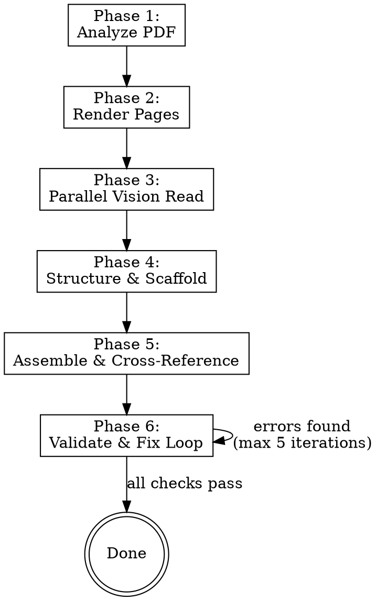
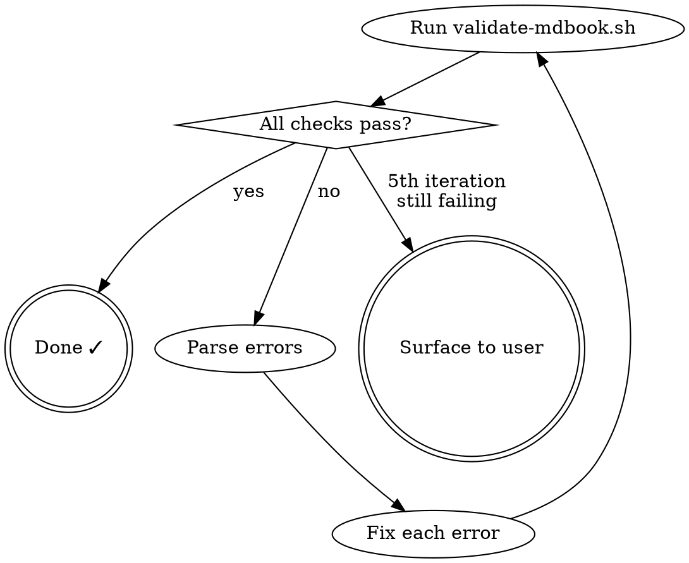

# Converting PDF Books to mdBook

One-shot conversion of scanned PDF books into professional mdBook format using AI vision and parallel subagents.

**Core principle:** The AI model reads rendered page images directly via vision — no OCR tools. Helper scripts handle only deterministic tasks (rendering pages, validating output). The model does all interpretation, structuring, and markdown generation.

## Prerequisites

Before starting, verify all tools are available:

```bash
# Run from the skill's scripts directory
./scripts/setup-tools.sh --check
```

Required tools: `pdfinfo`, `pdftoppm`, `pdftotext` (poppler-utils), `mdbook`, `markdownlint-cli2`

If any are missing, run without `--check` to install them.

## Pipeline Overview



## Checklist

You MUST create a task for each item and complete them in order:

1. **Verify prerequisites** — run `setup-tools.sh --check`, install if needed
2. **Analyze PDF** — extract metadata, detect structure, build chapter map
3. **Confirm chapter map with user** — present findings, get approval before bulk processing
4. **Render pages to images** — run `render-pages.sh` for all pages
5. **Parallel vision read** — dispatch subagents to read page chunks
6. **Structure and scaffold mdBook** — create book.toml, SUMMARY.md, chapter files
7. **Assemble and cross-reference** — merge chunks, fix links, typography pass
8. **Validate and fix loop** — run `validate-mdbook.sh`, fix errors, repeat until clean
9. **Final report** — summarize results, flag uncertain readings for human review

## Phase 1: Analyze PDF

Extract everything you can about the book before reading any pages:

```bash
# Get metadata
pdfinfo <pdf-file>

# Check if text layer exists (scanned PDFs may have poor OCR)
pdftotext <pdf-file> - | head -300
```

**From metadata, extract:**
- Title, author, creation date, page count
- Whether a text layer exists (and its quality)

**Find the Table of Contents:**
1. If text layer exists, search for "TABLE OF CONTENTS", "CONTENTS", or similar
2. If text is poor/missing, render the first 15–20 pages as images and read them via vision
3. Build a **chapter map**: `{ chapter_title: [start_page, end_page] }`

**Include in chapter map:**
- Front matter (title page, copyright, dedication, preface, introduction)
- All chapters/parts
- Back matter (appendix, index, bibliography, glossary)

**Present the chapter map to the user** and get confirmation before proceeding. This is a hard gate — do NOT proceed with bulk rendering until the user approves the structure.

## Phase 2: Render Pages to Images

```bash
# Render all pages at 300 DPI
./scripts/render-pages.sh <pdf-file> /tmp/pdf-conversion/<book-slug>/pages/ --dpi 300
```

**300 DPI** is the sweet spot — high enough for AI vision to read accurately, manageable file sizes.

Verify the output: rendered image count must match expected page count from pdfinfo.

**Disk space warning:** An 800-page book at 300 DPI generates ~2–3 GB of images. Ensure sufficient disk space. Clean up after conversion is complete.

## Phase 3: Parallel Vision Reading

This is the most token-intensive phase. Divide pages into chunks and dispatch parallel subagents.

### Chunk Strategy

**Chunk size: 20–30 pages** (balances parallelism vs. context continuity)

Align chunks on chapter boundaries where possible. If a chapter is longer than 30 pages, split at section breaks.

### Subagent Dispatch

For each chunk, dispatch a subagent with:

1. **Page images** for the chunk (as file paths for the agent to view)
2. **Chapter context**: which chapter these pages belong to, what came before
3. **Formatting instructions**: reference `references/mdbook-formatting-guide.md`
4. **Output format**: clean markdown with `<!-- pdf-page: N -->` comments

**Subagent prompt template:**

```
You are converting pages [START]-[END] of "[BOOK TITLE]" from scanned images to markdown.

These pages belong to: [CHAPTER NAME]
Previous chunk ended with: [LAST PARAGRAPH OR CONTEXT]

Read each page image carefully and produce clean markdown following these rules:
- Mark every page boundary: <!-- pdf-page: N -->
- Use ## for chapter titles, ### for sections, #### for subsections
- Preserve all text faithfully — do not summarize or paraphrase
- Mark uncertain readings: <!-- ocr-uncertain: "word" -->
- Skip page headers/footers (running titles, page numbers)
- Skip decorative elements
- Use blockquotes (>) for prayers, quoted passages, or verse
- Use proper footnote syntax: [^1] with definitions at end
- Straight quotes, em-dashes (—), proper ellipsis (…)

Page images are at: [FILE PATHS]

Output ONLY the markdown content. No explanations or commentary.
```

### Handling Chunk Boundaries

Provide 1–2 pages of overlap between chunks so subagents have context. The coordinator (you) merges overlapping content and resolves any discrepancies.

## Phase 4: Structure & Scaffold mdBook

Once all chunks are read, create the mdBook project:

```bash
mdbook init <output-dir> --title "<title>"
```

**Configure book.toml:**
```toml
[book]
title = "Book Title"
authors = ["Author Name"]
language = "en"
description = "Converted from PDF. Original: [source info]"

[build]
build-dir = "book"

[output.html]
no-section-label = false
```

**Generate SUMMARY.md** from the chapter map. Follow the structure in `references/mdbook-formatting-guide.md`:

```markdown
# Summary

[Title Page](./front-00-title.md)
[Preface](./front-01-preface.md)

---

- [Chapter 1: Title](./chapter-01-slug.md)
- [Chapter 2: Title](./chapter-02-slug.md)

---

- [Index](./back-01-index.md)
```

**Create chapter files** matching SUMMARY.md. Use naming convention: `chapter-NN-slug.md`

## Phase 5: Assemble & Cross-Reference

Place chunk outputs into the correct chapter files. Then perform these passes:

### 1. Merge Pass
- Resolve chunk boundary overlaps (deduplicate content from overlapping pages)
- Ensure paragraphs split across chunks are properly joined
- Verify no content is missing between chunks

### 2. Cross-Reference Pass
- Convert "see page X" references to markdown links: `[text](./chapter-NN.md#heading)`
- Consolidate footnotes (renumber sequentially within each chapter)
- Verify every footnote reference has a definition and vice versa

### 3. Typography Pass
- Fix common OCR vision artifacts
- Normalize quotation marks, dashes, ellipses
- Fix spacing issues (double spaces, missing spaces after periods)
- Ensure proper Unicode encoding for accented characters

### 4. Structure Pass
- Verify heading hierarchy (no skipped levels)
- Ensure page metadata comments are present and sequential
- Confirm chapter ordering matches original book

## Phase 6: Validate & Fix Loop

```bash
./scripts/validate-mdbook.sh <mdbook-project-dir>
```



**Validation includes:**
1. `mdbook build` succeeds
2. `markdownlint-cli2` passes with skill config
3. All SUMMARY.md links resolve
4. No orphaned .md files
5. Page metadata is sequential

**If errors are found:** Fix them, then re-run. Maximum 5 iterations — if still failing after 5 attempts, surface the remaining errors to the user with context.

**After validation passes**, also check `references/validation-checklist.md` for the manual verification items (content quality, completeness, OCR uncertain markers).

## Final Report

After successful conversion, report:

```
=== PDF to mdBook Conversion Complete ===

Source:     manual-of-prayers.pdf (804 pages)
Output:     ./manual-of-prayers-mdbook/
Chapters:   42 chapters + 6 front/back matter files
Pages:      804 pages processed
Uncertain:  12 OCR-uncertain markers (review recommended)

Build:      ✓ mdbook build successful
Lint:       ✓ markdownlint clean
Links:      ✓ all SUMMARY.md links valid

To view:    mdbook serve ./manual-of-prayers-mdbook/
To build:   mdbook build ./manual-of-prayers-mdbook/
```

**Always list `<!-- ocr-uncertain -->` markers** with their file locations so the user can review them.

## Cleanup

After conversion is verified:
- Delete rendered page images from temp directory
- Keep the mdBook project as the final output

## Common Mistakes

| Mistake | Fix |
|---------|-----|
| Skipping the chapter map confirmation | Always get user approval before bulk processing |
| Chunks too large (50+ pages) | Keep to 20–30 pages for reliable vision reading |
| Ignoring chunk boundary overlaps | Provide 1–2 page overlap, deduplicate in assembly |
| Missing page metadata comments | Every page boundary needs `<!-- pdf-page: N -->` |
| Running headers/footers in output | Strip repeated headers and page numbers |
| Summarizing instead of transcribing | Preserve ALL original text faithfully |
| Skipping validation loop | ALWAYS run validate-mdbook.sh before declaring done |

## Red Flags — STOP

| Thought | Reality |
|---------|---------|
| "The text layer is good enough" | Vision reading is more accurate for scanned books. Use vision. |
| "I'll validate at the end" | Validate after EACH major phase, not just at the end. |
| "This chapter is too short to bother with a file" | Every chapter gets its own file, no matter how short. |
| "I can skip the overlap pages" | Chunk boundaries without overlap WILL lose content. |
| "The user doesn't need to see the chapter map" | The chapter map confirmation is a HARD GATE. Always show it. |
| "markdownlint warnings are just style" | Lint warnings indicate structural issues. Fix them all. |
| "Close enough" | Run validate-mdbook.sh. Green or fix it. |

## Integration

- **REQUIRED BACKGROUND:** Understand `superpowers:subagent-driven-development` for parallel dispatch
- **REQUIRED BACKGROUND:** Understand `superpowers:dispatching-parallel-agents` for chunk processing
- **Recommended:** Use `superpowers:verification-before-completion` before declaring the conversion done
