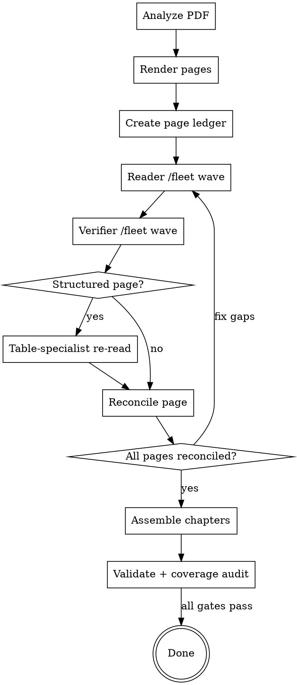

# Converting PDF Books to mdBook

Convert scanned PDF books into mdBook format with GitHub Copilot CLI native
subagents.

**Core principle:** page accountability comes before chapter assembly. Every
physical PDF page must be read, verified, reconciled, and, when needed,
re-read by a table specialist before that page may be assembled into a
chapter.

**Default orchestration contract:**

- `1 physical PDF page -> 1 reader subagent`
- `1 physical PDF page -> 1 verifier subagent`
- `structured page -> separate table-specialist re-read`
- `chapter assembly -> only after reader/verifier reconciliation`

## Quick Reference

| Unit | Default |
| --- | --- |
| Reader scope | Exactly 1 physical PDF page |
| Verifier scope | The same 1 physical PDF page |
| Structured pages | Separate table-specialist re-read |
| Coordinator | Native Copilot CLI orchestration via `/fleet` |
| Deterministic scripts | Rendering and validation only |
| Done means | Build + lint + coverage audit all pass |

## Prerequisites

Before starting, verify the deterministic tooling is available:

```bash
# Run from the skill's scripts directory
./scripts/setup-tools.sh --check
```

Required tools: `pdfinfo`, `pdftoppm`, `mdbook`, and `markdownlint-cli2`.

If any are missing, run the setup script without `--check` to install them.

## Deterministic vs. Agentic Work

Use deterministic scripts only for deterministic work:

- `setup-tools.sh` checks tool availability.
- `render-pages.sh` renders PDF pages to images.
- `validate-mdbook.sh` runs build, lint, and file validation.

Use native Copilot CLI subagents for judgment-heavy work:

- page reading
- page verification
- structured-page table re-reads
- reconciliation decisions
- chapter assembly decisions

**Non-negotiable rule:** transcription and verification must come from the
model's native vision capabilities. Do **not** use OCR engines, extracted text
layers, or text-conversion shortcuts as a substitute for reading the rendered
page images.

**Do NOT** write shell loops, tmux sessions, background workers, or headless
helper scripts to spawn agents. In Copilot CLI, `/fleet` is the orchestration
surface for fan-out and reconciliation. Bash is for rendering and validation,
not for simulating a fleet.

## Pipeline Overview



## Checklist

You MUST create a task for each item and complete them in order:

1. **Verify prerequisites** — run `setup-tools.sh --check`, install if needed.
2. **Analyze PDF** — extract metadata and build the chapter map.
3. **Confirm chapter map with user** — this is a hard gate before bulk work.
4. **Render pages to images** — run `render-pages.sh` for the working range.
5. **Create a page-accountability ledger** — one row per physical page.
6. **Dispatch reader and verifier waves** — native Copilot CLI subagents only.
7. **Dispatch table-specialist re-reads** — every structured page gets one.
8. **Reconcile every page** — resolve disagreements before assembly.
9. **Assemble and scaffold mdBook** — only from reconciled pages.
10. **Validate and audit coverage** — build, lint, and coverage audit all pass.
11. **Final report and cleanup** — summarize outputs and unresolved concerns.

## Phase 1: Analyze PDF

Extract everything you can about the book before reading pages:

```bash
pdfinfo <pdf-file>
```

Capture at least:

- title
- author
- creation date
- total page count
- page dimensions and rotation if relevant to rendering

Find the table of contents:

1. Render the first 15 to 20 pages and inspect them with native vision.
2. Find `TABLE OF CONTENTS`, `CONTENTS`, or equivalent headings visually.
3. Build a chapter map: `{ chapter_title: [start_page, end_page] }`.

Do not fall back to extracted text during analysis. The rendered page images are
the source of truth for chapter discovery and later transcription.

Include front matter, main chapters or parts, and back matter.

**Hard gate:** present the chapter map to the user and get approval before
bulk rendering or `/fleet` dispatch. A bad chapter map poisons every later
assembly step.

## Phase 2: Render Pages to Images

```bash
./scripts/render-pages.sh <pdf-file> /tmp/pdf-conversion/<book-slug>/pages/ \
  --dpi 300
```

Use 300 DPI unless the source requires a different setting.

Verify the output immediately:

- rendered image count matches `pdfinfo` page count
- filenames map cleanly to physical PDF page numbers
- disk space is sufficient for the full render set

## Phase 3: Create the Page-Accountability Ledger

Before you dispatch any reader, create an accountability record for every
physical PDF page in scope. This ledger is the conversion contract.

Track at least these fields for each page:

- physical page number
- printed page label, if visible
- chapter assignment
- reader status
- verifier status
- structured-page flag
- table-specialist status
- reconciliation status
- assembled file path

A simple ledger can look like this:

```text
page=42 chapter=front-03-preface read=pending verify=pending
structured=unknown table_reread=not-needed reconciled=no assembled=
```

**Hard gate:** if a page does not have a ledger row, it does not exist for the
conversion. Do not rely on memory or prose summaries for coverage.

## Phase 4: Native Copilot CLI Page Orchestration

Use `/fleet` to fan out page-scoped work. The accountability unit is always
one physical page, even if you provide adjacent pages as context.

### Reader Wave

Dispatch one reader subagent per physical page. The reader may see adjacent
pages for context, but it must output transcription for the target page only.

**Reader prompt template:**

```text
You are the page reader for physical PDF page [PHYSICAL_PAGE] of
"[BOOK TITLE]".

Your target is exactly one physical page. You may inspect adjacent page images
for continuation context, but your output must cover only physical page
[PHYSICAL_PAGE].

Inputs:
- Target image: [TARGET_IMAGE_PATH]
- Optional context images: [PREV_IMAGE_PATH], [NEXT_IMAGE_PATH]
- Chapter assignment: [CHAPTER_NAME]
- Formatting authority:
  skills/converting-pdf-to-mdbook/references/mdbook-formatting-guide.md

Required checks before writing:
1. Inspect the full page, including top and bottom margins, inner and outer
   margins, footnote area, side-notes, captions, and table notes.
2. Decide whether the page contains structured content such as a table,
   matrix, calendar, ledger, form, or parallel columns.
3. Distinguish body text from repeated running headers, repeated footers,
   page numbers, and decorative ornaments.

Output contract:
- Return status: DONE or DONE_WITH_CONCERNS.
- State whether this page needs a table-specialist re-read.
- Emit markdown for this page only.
- Start with the exact page marker:
  <!-- pdf-page: physical=[PHYSICAL_PAGE] printed=[PRINTED_LABEL_IF_VISIBLE] -->
- Preserve all body text, footnotes, side-notes, marginalia, captions,
  and table notes that belong to the page.
- Use <!-- vision-uncertain: "..." --> for uncertain readings.
- Do not summarize, paraphrase, normalize away notes, or merge multiple
  physical pages into one answer.
```

### Verifier Wave

Dispatch one verifier subagent per physical page. The verifier checks the same
page independently against the reader output.

**Verifier prompt template:**

```text
You are the page verifier for physical PDF page [PHYSICAL_PAGE] of
"[BOOK TITLE]".

Inputs:
- Target image: [TARGET_IMAGE_PATH]
- Reader output for the same page: [READER_OUTPUT]
- Optional context images: [PREV_IMAGE_PATH], [NEXT_IMAGE_PATH]
- Chapter assignment: [CHAPTER_NAME]
- Formatting authority:
  skills/converting-pdf-to-mdbook/references/mdbook-formatting-guide.md

Audit this page from edge to edge. Explicitly check:
- top and bottom margins
- inner and outer margins
- footnotes and footnote continuations
- side-notes and marginalia
- captions, legends, and table notes
- whether repeated headers and footers were correctly excluded

Return:
- VERIFIED if the page is complete and correctly excluded only repeated
  artifacts
- NEEDS_REVISION if anything is missing, misplaced, invented, or misread
- TABLE_SPECIALIST_REQUIRED if structured content needs a dedicated re-read

When reporting problems, name the missing or suspect region precisely.
Examples: "outer margin note omitted", "table note below rule missing",
"footnote 3 dropped", "caption merged into body paragraph".
```

### Structured Pages: Table-Specialist Re-Read

Any page with tables or other structured content gets its own specialist pass.
Do this even if the reader and verifier mostly agree.

Trigger a table-specialist re-read for pages with:

- simple or complex tables
- continuation tables
- ledgers, calendars, or schedules
- multi-column forms
- side labels or row groups
- captions, legends, or notes tied to structured layouts

**Table-specialist prompt template:**

```text
You are the table specialist for physical PDF page [PHYSICAL_PAGE] of
"[BOOK TITLE]".

Your job is to re-read only the structured content on this page and verify
that tables, row groups, captions, legends, side labels, and table notes are
represented faithfully. You must also explicitly inspect the page margins,
footnotes, side-notes, and notes attached to the structured content.

Inputs:
- Target image: [TARGET_IMAGE_PATH]
- Reader output: [READER_OUTPUT]
- Verifier findings: [VERIFIER_FINDINGS]
- Formatting authority:
  skills/converting-pdf-to-mdbook/references/mdbook-formatting-guide.md

Return:
- Whether the page needs a pipe table or HTML table
- Corrections required for headers, merged cells, continuation labels,
  legends, and notes
- Any text that was omitted from margins, footnotes, side-notes, table notes,
  captions, or side labels

Do not approve a page until margins, footnotes, side-notes, captions,
legends, and table notes have been accounted for explicitly.
```

## Phase 5: Reconcile Before Assembly

Reader and verifier outputs must be reconciled page by page.

For each physical page:

1. Compare the reader output, verifier result, and table-specialist result,
   if any.
2. Fix omissions or disagreements with a targeted re-read of that same page.
3. Re-run the verifier on every corrected page before closing reconciliation.
4. Re-run the table specialist too if the corrected page still contains
   structured content or if the fix touched table-adjacent notes.
5. Mark the page `reconciled=yes` only when:
   - the verifier has approved the latest corrected output,
   - any required table-specialist pass has approved the latest corrected
     output, and
   - the final page output still covers exactly one physical page.

**Hard gate:** chapter assembly is forbidden until every page in that chapter
is reconciled. Build-ready markdown assembled from unreconciled pages is still
incomplete work.

## Phase 6: Structure, Scaffold, and Assemble mdBook

Once the relevant pages are reconciled, create the mdBook project:

```bash
mdbook init <output-dir> --title "<title>"
```

Configure `book.toml` and `SUMMARY.md` using the verified chapter map and the
formatting guide.

Assembly rules:

- Append reconciled page outputs in physical page order.
- Preserve exact page markers from the formatting guide.
- Keep chapter boundaries aligned to the approved chapter map, not arbitrary
  page slices.
- Convert cross-references and normalize typography only after page coverage
  is locked.
- Do not resurrect the old chunk merge pattern. Page reconciliation replaces
  chunk overlap management.

## Phase 7: Validate and Audit Coverage

Run the deterministic validation script:

```bash
./scripts/validate-mdbook.sh <mdbook-project-dir>
```

Then run the full coverage audit from
`references/validation-checklist.md`.

### Validation Gates

1. **Build gate** — `mdbook build` succeeds.
2. **Lint gate** — `markdownlint-cli2` passes.
3. **Coverage audit gate** — page accountability, structured-page re-reads,
   completeness, and reconciliation checks all pass.

**Hard gate:** build and lint success are necessary but not sufficient.
The conversion is NOT done until the coverage audit succeeds.

Use this claim discipline:

- `mdbook build` passes -> build gate passed
- `markdownlint-cli2` passes -> lint gate passed
- page ledger and validation checklist pass -> coverage audit passed
- only all three together -> conversion complete

If build and lint are green but the coverage audit finds a missing page,
missing footnote, unresolved side-note, or skipped table re-read, the job is
still failing.

## Final Report

After all gates pass, report:

```text
=== PDF to mdBook Conversion Complete ===

Source:     manual-of-prayers.pdf (804 pages)
Output:     ./manual-of-prayers-mdbook/
Chapters:   42 chapters + 6 front/back matter files
Pages:      804 pages reconciled
Readers:    804 reader subagents completed
Verifiers:  804 verifier subagents completed
Tables:     73 table-specialist re-reads completed
Uncertain:  12 vision-uncertain markers (review recommended)

Build:      PASS
Lint:       PASS
Coverage:   PASS

Next:       mdbook serve ./manual-of-prayers-mdbook/
```

Always list unresolved `<!-- vision-uncertain -->` markers with file locations.
If any page required manual intervention, identify the exact physical page.

## Cleanup

After verification is complete:

- delete rendered page images from the temporary directory
- keep the mdBook project as the final output
- keep the accountability ledger until the user accepts the result

## Common Mistakes

| Mistake | Fix |
| --- | --- |
| Using 20 to 30 page chunks | Dispatch one reader and one verifier per page |
| Treating `/fleet` like bash | Use native subagents, not shell workers |
| Assembling before reconciliation | Reconcile every page before assembly |
| Skipping table re-reads | Re-read every structured page separately |
| Trusting build and lint alone | Pass the coverage audit too |
| Ignoring margins or notes | Check footnotes, side-notes, and table notes |

## Red Flags — STOP

| Thought | Reality |
| --- | --- |
| "Build passes so it's fine" | Build proves rendering, not completeness |
| "Multi-page chunks are good enough" | Page accountability is the contract |
| "The verifier can spot-check later" | Every page gets a verifier first |
| "The table mostly looks right" | Structured pages require specialist review |
| "I can script my own worker fleet" | Use native Copilot CLI orchestration |
| "Headers and footers are obvious" | Check margins and notes explicitly |
| "Close enough" | Reconcile the exact page or the job is not done |

## Integration

**Required workflow skills:**

- **superpowers:dispatching-parallel-agents** — plan `/fleet` waves for
  independent page readers, verifiers, and table specialists.
- **superpowers:subagent-driven-development** — use the same review discipline
  when reconciling verifier findings and re-read fixes.
- **superpowers:verification-before-completion** — required before claiming
  the conversion is complete.

**Required references:**

- `references/mdbook-formatting-guide.md`
- `references/validation-checklist.md`

**Remember:** native Copilot CLI orchestration handles agent fan-out.
Deterministic scripts render and validate files. Do not mix those roles.
